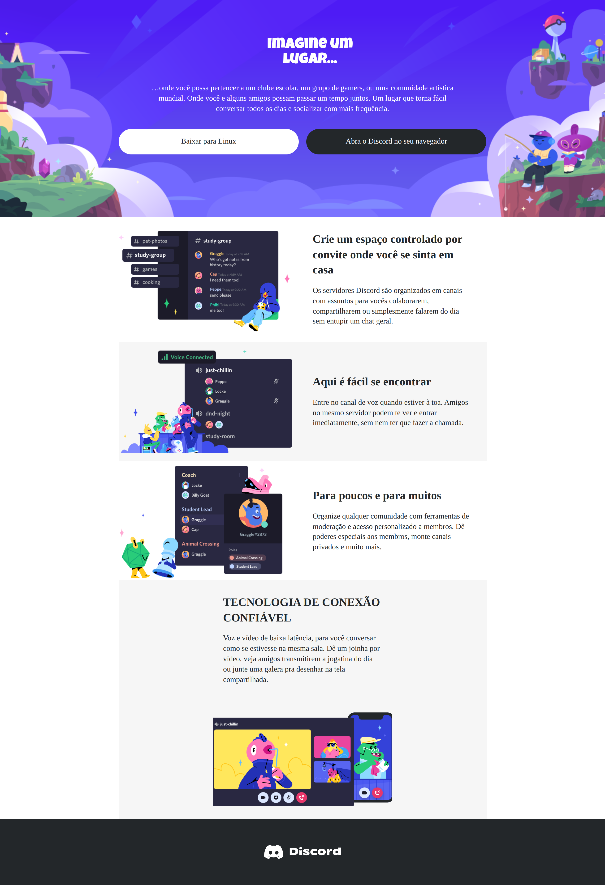
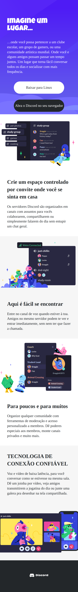

<h1>
    
    Formação CSS Web Developer
</h1>

# :computer: Desafio 04: Construindo um Layout Responsivo Para o Site do Discord Com CSS

Neste Desafio você colocará a mão na massa e irá reproduzir a página da incrível plataforma do Discord colocando em prática todos os conceitos aprendidos até aqui, principalmente sobre Responsividade no CSS.

Seja criativo(a) e dê a sua identidade para o Projeto. Lembre-se que para um(a) Profissional de Tecnologia é super importante ter um portfólio sólido e completo.

 
[Link do Figma](https://www.figma.com/file/NRBYrG5d4DSzObv7dpTqoM/Desafio-Responsividade---DIO) :
Aqui deixamos o link do Design no Figma apresentado pela Expert durante o Desafio para que você o tenha como referência:

# :bulb: Solução do desafio

Implementação nos arquivos <b>index.html</b> e <b>assets/css/style.css</b>. 

Print screen das páginas:

 
 

